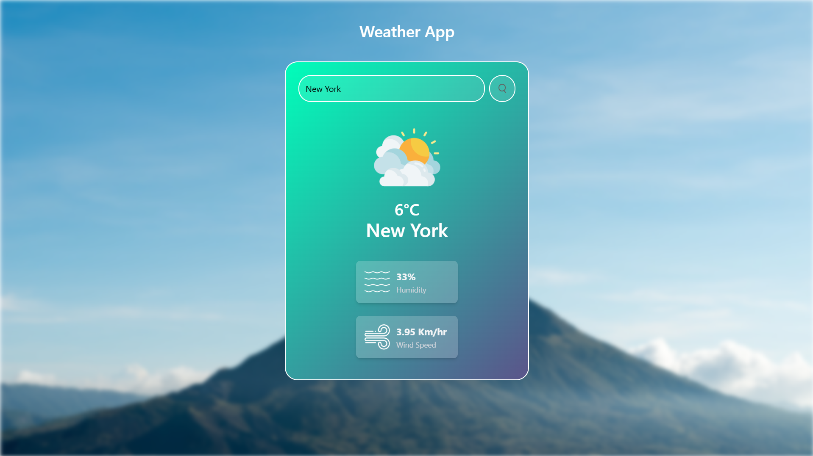

# 🌤️ Weather App

A simple and responsive weather application built using **HTML**, **CSS**, and **JavaScript** that fetches real-time weather data using the OpenWeather API.

## 🚀 Features

* Search weather by city name
* Displays:

  * Temperature
  * Humidity
  * Wind Speed
  * Weather Condition
* Dynamic weather icons based on current weather
* Responsive design for desktop and mobile devices
* Loading and error handling messages

## 🛠️ Technologies Used

* HTML5
* CSS3
* JavaScript (ES6)
* OpenWeather API

## 📂 Project Structure

```text
Weather-App/
│── index.html
│── style.css
│── script.js
│── config.example.js
│── .gitignore
└── images/
    │── bg.jpg
    │── clear.png
    │── clouds.png
    │── drizzle.png
    │── humidity.png
    │── mist.png
    │── rain.png
    │── search.png
    │── snow.png
    └── wind.png
```

## ⚙️ Setup Instructions

1. Clone the repository:

```bash
git clone https://github.com/vaishnavinayak07/PRODIGY_WD_04.git
```

2. Navigate to the project folder:

```bash
cd PRODIGY_WD_04
```

3. Create a file named `config.js` in the root directory.

4. Add your OpenWeather API key:

```js
export const API_KEY = "YOUR_API_KEY_HERE";
```

5. Open `index.html` in your browser or run the project using Live Server.

## 🔑 Getting an API Key

1. Create an account on OpenWeather.
2. Generate an API key from your dashboard.
3. Paste the key into `config.js`.

## 📸 Preview



## 📌 Future Improvements

* 5-day weather forecast
* Current location weather using Geolocation API
* Dark/Light mode toggle
* Recent search history

## 👩‍💻 Author

**Vaishnavi Nayak**

Created as part of the **Prodigy InfoTech Web Development Internship**.
